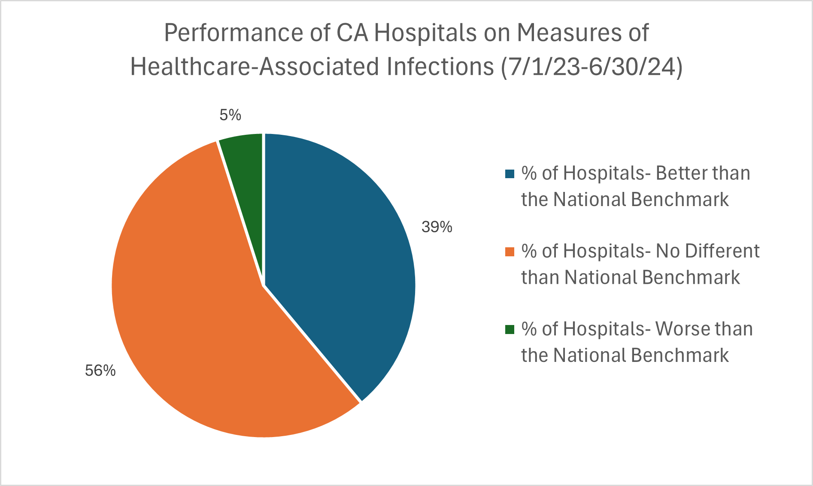
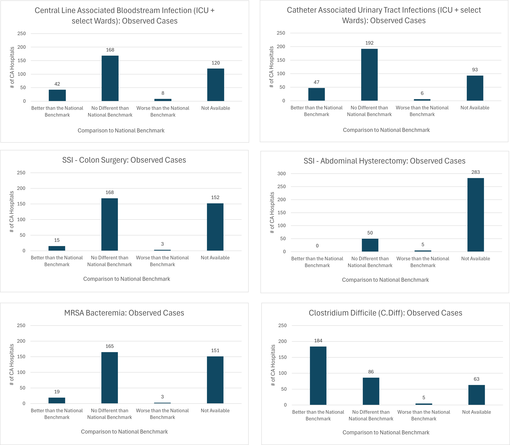

# healthcare-associated-infections

## Data Analytics Project: Healthcare-Associated Infections
The goal of this project is to study healthcare associated infections at hospitals in California based on a dataset published by the Centers for Medicare & Medicaid Services (CMS). 
The Healthcare-Associated Infection (HAI) measures are created by Centers for Disease Control and Prevention (CDC). Data was collected nationally by the National Healthcare Safety Network (NHSN), that aims to collect data to identify problems, support prevention efforts, and eventually eradicate infections that are acquired by patients in hospitals (https://www.cdc.gov/nhsn/index.html).  

### Project Questions
*	How problematic are healthcare-associated infections at hospitals in California compared to the national benchmark? 
	Specifically, regarding infections that are acquired by patients in hospitals, what percentage of California hospitals are considered no different than the national benchmark, better than the national benchmark, and worse than the national benchmark based on the Centers for Medicare & Medicaid Services data?
*	Across California hospitals which type(s) of infection was associated with the highest number of cases performing worse than the national benchmark?
*	What are recommendations to hospitals based on trends regarding healthcare-associated infections?

## Results
Hospital data were collected from July 1, 2023 to June 30, 2024. The published dataset from Centers for Medicare & Medicaid Services (CMS) was cleaned and analyzed using Excel. The data were filtered to focus exclusively on hospitals in California. The graphs below feature the number of California hospitals and how they compare to the national benchmark based on the type of infections that patients acquire in hospitals. 

 
	 

 
 
 

 

 

 

 

## Conclusions
*	Examining hospitals in California that were part of the Centers for Medicare & Medicaid Services (CMS) dataset revealed that about 37% of hospitals had missing data on 1 or more measures of health-care related infections. 
*	Analysis of available healthcare-related infection data overall (i.e., across all infection type categories) indicated 39% of California hospitals scored better than the National Benchmark on at least one measure of infection type, 56% of California hospitals scored no different than the National Benchmark on 1 or more areas of infection type, and 5% of California hospitals (24 hospitals total) scored worse than the National Benchmark in one or more areas of infection type. 
*	Based on the available data overall, 95% of hospitals in California are scoring no different than the National Benchmark or better than the National Benchmark regarding health-care related infections.
*	The type of infection associated with the highest number of California hospitals performing worse than the National Benchmark was the Central Line Associated Bloodstream Infection (ICU + select Wards). There were 8 hospitals that performed worse than the National Benchmark in this category.

## Recommendations
*	__Follow up regarding missing data:__ 
Given the significant amount of unavailable data on health-care related infections (i.e., over a third of hospitals had some form of missing data), follow-up at each of these hospitals would be recommended to determine why so much data were missing. In the case of abdominal hysterectomy there were more cases of missing data than available data. Was this because some hospitals did not perform this procedure and therefore data on associated infections would not have been applicable? Or were there problems with data collection? If the issue was with data collection, then it is recommended that data collection systems be monitored to ensure adequate procedures are in place to collect data for future projects.

*	__Follow-up with hospitals that scored worse than the National Benchmark:__ 
It is recommended to follow up with the 24 hospitals that scored worse than the National Benchmark in 1 or more areas of infection type and explore why they are scoring below the National Benchmark. According to the Centers for Medicare & Medicaid Services, many patients can avoid acquiring healthcare-associated infections when hospitals use “CDC-recommended infection control steps.” Therefore, additional training and/or monitoring may be necessary in the hospitals that scored worse than the National Benchmark. 

*	__Additional training and/or monitoring of Central Line Associated Bloodstream Infection (ICU + select Wards):__ 
Because Central Line Associated Bloodstream Infection was the most common type of infection acquired in hospitals in California, special training and monitoring of this infection type may be useful in the hospitals that scored worse than the National Benchmark in this area. 
